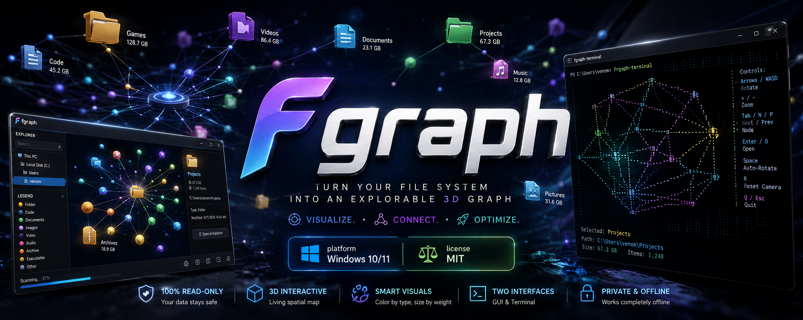

# fgraph




Turn your real Windows file system into an explorable 3D graph. Instead of a nested list of folders, see your files as a living, spatial map — colored by type, sized by weight, navigable with just a mouse.

Everything is strictly read-only: no filesystem driver, no virtual drive, no writes. Both apps just read your real folders and draw what's there.

## Two ways to run it

| | `fgraph-gui` | `fgraph-terminal` |
|---|---|---|
| **Runs in** | a native desktop window | your terminal |
| **Look** | physics-driven, glowing, "living" graph | braille-rendered 3D wireframe |
| **Controls** | mouse — drag to orbit, drag a node to pull it | keyboard |
| **Best for** | everyone else | terminal/power users, SSH sessions |

## Getting started

### Just want to use it

Grab the latest build from the [Releases page](https://github.com/leadervenom/Files-Graph/releases):

- **`fgraph-gui-setup.exe`** — a normal installer wizard (Next → Next → Install), with a Start Menu / desktop shortcut and a proper uninstaller in Windows Settings.
- **`fgraph-gui.exe`** — portable, no installation. Download and double-click; nothing else on disk.

Either way, there's nothing to install first — no Python, no PowerShell, no dependencies to manage. On the rare machine missing the Microsoft Edge WebView2 Runtime, the app installs it silently on first launch with no prompts.

You can also get the portable exe by cloning the repo — it's committed at the root:

```powershell
git clone https://github.com/leadervenom/Files-Graph.git
```

Then just double-click `fgraph-gui.exe` inside the cloned folder.

### Running from source (developers)

```powershell
git clone https://github.com/leadervenom/Files-Graph.git
cd Files-Graph

# Terminal version — compiles the Rust binary on first run
.\fgraph-terminal.ps1

# Desktop version — sets up a Python venv and installs deps on first run
.\fgraph-gui.ps1
```

Both launchers set themselves up automatically the first time; every run after is instant.

> Both launchers are plain PowerShell scripts — if double-clicking doesn't work, open PowerShell in the repo folder and run `.\fgraph-terminal.ps1` or `.\fgraph-gui.ps1` directly.

### Building the distributables

| Script | Produces | Requires |
|---|---|---|
| `fgraph-gui\build_exe.ps1` | `fgraph-gui.exe` (portable, copied to repo root) | Python 3.10+ |
| `fgraph-gui\build_installer.ps1` | `fgraph-gui\installer_output\fgraph-gui-setup.exe` | [Inno Setup 6](https://jrsoftware.org/isinfo.php) (`winget install JRSoftware.InnoSetup`) |

Rebuild and commit the updated root `fgraph-gui.exe` whenever `fgraph-gui`'s Python code changes. The installer just repackages that exe, so it isn't committed — build it and attach it to a GitHub Release instead.

## Requirements

- **Windows 10/11**
- **`fgraph-terminal`** (source builds only) needs the Rust toolchain — install via [rustup.rs](https://rustup.rs)
- **`fgraph-gui`** (source builds only) needs **Python 3.10+** — install from [python.org](https://python.org)
- **`fgraph-gui`** needs the Microsoft Edge WebView2 Runtime (present by default on Windows 11 and most up-to-date Windows 10 machines) — installed silently and automatically on first launch if missing, no matter which distribution you use

You only need the toolchain for whichever version you're building from source — the prebuilt exe and installer need neither.

## `fgraph-gui` — the desktop app

Opens straight to an account picker: pick a Windows user account on the machine, then a folder inside it (or the whole account). The graph loads progressively — like an open-world game, only the area you're actually looking at renders in detail. Unexplored folders show up as a single dimmed "aggregate" node; double-click one to load its contents in place.

**Controls**
- Drag = orbit the camera
- Scroll = zoom
- Drag a node = pull it — it springs back into place under the other nodes' pull
- Click a node = select it (see its name/path/size in the sidebar)
- Double-click a folder = open it in the graph (load its contents)
- Double-click a file = open it on disk

The sidebar also has search, a legend, an "Open in Explorer" button, and a folder browser for scanning anywhere else on disk.

## `fgraph-terminal` — the terminal app

```
.\fgraph-terminal.ps1 [path] [max-depth]
```

Renders the same idea directly in your terminal using Unicode braille characters — no GUI, works over SSH, nothing to install beyond Rust. Defaults to your home folder at depth 6 if no arguments are given.

**Controls**
- Arrow keys / WASD = rotate camera
- `+` / `-` = zoom
- Tab / N / P = cycle node selection
- Enter / O = open the selected file/folder
- Space = toggle auto-rotate
- R = reset camera
- Q / Esc = quit

## How it works

Both apps scan a folder with the same shared rules — file-type category colors (code/docs/image/video/audio/archive/executable/data) and size-weighted node radius — so a file means the same thing visually no matter which version you're looking at. `fgraph-gui` runs entirely offline too — its 3D rendering library and fonts are vendored locally, no CDN calls at runtime.

## Project structure

```
fgraph/                     Rust terminal app (crossterm + braille rendering)
  src/
  Cargo.toml

fgraph-gui/                 Python desktop app (pywebview + physics-based 3D graph)
  webapp.py                   entry point / native-dialog + filesystem bridge
  scan.py                     filesystem scanning
  colors.py                   shared color/size rules
  web/                         the actual UI (HTML/CSS/JS + vendored 3d-force-graph)
  build_exe.ps1                builds the portable fgraph-gui.exe
  build_installer.ps1          builds the fgraph-gui-setup.exe installer
  installer.iss                Inno Setup script for the installer

fgraph-terminal.ps1          launcher for the terminal app (source builds)
fgraph-gui.ps1                launcher for the desktop app (source builds)
fgraph-gui.exe                committed, standalone build of fgraph-gui — double-click, nothing else needed
```

## Development

Both apps have a `?mock=1` dev harness for `fgraph-gui`'s frontend — open `fgraph-gui/web/index.html` via a local static server with `?mock=1` in the URL to iterate on the UI in a regular browser without needing the desktop shell, and `&mockbig=1` to stress-test against a synthetic large tree.

## Documentation

- [INSTALL.md](INSTALL.md) — detailed installation guide (installer, portable exe, or building from source)
- [CONTRIBUTING.md](CONTRIBUTING.md) — how to file issues and submit changes
- [CODE_OF_CONDUCT.md](CODE_OF_CONDUCT.md) — community guidelines
- [SECURITY.md](SECURITY.md) — how to report a vulnerability

## License

MIT — see [LICENSE](LICENSE).
